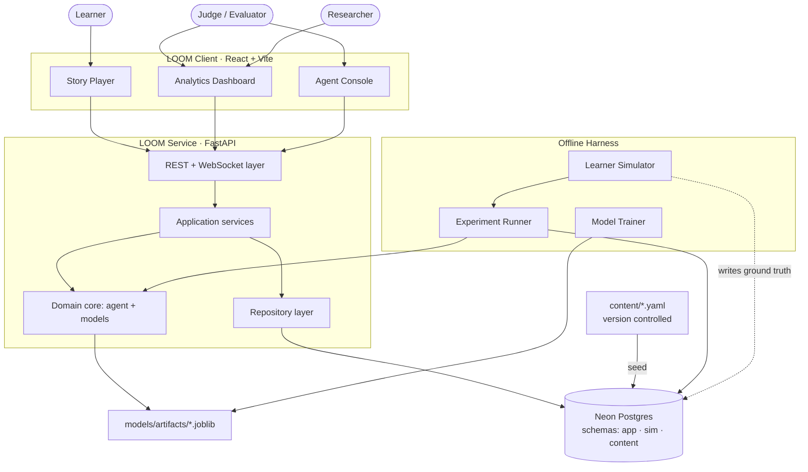
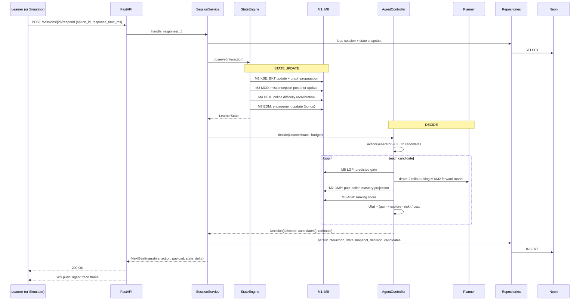

# Architecture

**System:** LOOM — Adaptive Story Challenge Engine
**Shape:** single-page React client, one FastAPI service, one Neon Postgres database, an offline
experiment harness that shares the same domain core.

---

## 1. Architectural principles

| # | Principle | Consequence |
|---|---|---|
| A1 | **The domain core is pure.** The learner model, the agent, and the ML components import no database, no HTTP, no clock. | The whole intelligence layer is unit-testable in milliseconds and runs identically inside the API and inside the offline harness. |
| A2 | **One decision engine, two drivers.** A live session and a 500-learner simulation call *the same* `AgentController`. | The number we show a judge is produced by the code that runs the demo, not by a separate script. |
| A3 | **Every decision is a persisted record, not a log line.** | Explainability is a query, not a reconstruction. |
| A4 | **Ground truth is behind a permission boundary**, not behind a naming convention. | Anti-circularity is provable at the DBMS. |
| A5 | **The database is a projection of version-controlled content**, not the source of truth for content. | A corrupt DB is fixed by re-seeding, not by archaeology. |
| A6 | **Read models are precomputed.** Dashboard panels read from views and snapshot tables, not from live recomputation. | First paint stays under 1.5 s even with a 500-learner experiment loaded. |

---

## 2. Context diagram



---

## 3. Layers

```
┌──────────────────────────────────────────────────────────────────┐
│ loom/api/          FastAPI routers, WebSocket, Pydantic schemas   │  no business logic
├──────────────────────────────────────────────────────────────────┤
│ loom/services/     SessionService, DecisionService,               │  orchestration,
│                    ExperimentService, ContentService              │  transactions
├──────────────────────────────────────────────────────────────────┤
│ loom/agent/        AgentController, StateEngine, ActionGenerator, │  PURE
│                    Scorer, Planner, Replanner, Rationale          │  no I/O
├──────────────────────────────────────────────────────────────────┤
│ loom/ml/           M1..M8 components, feature builders, training  │  PURE at inference
├──────────────────────────────────────────────────────────────────┤
│ loom/domain/       Concept graph, item bank, action types,        │  PURE
│                    LearnerState, value objects                    │
├──────────────────────────────────────────────────────────────────┤
│ loom/repo/         SQLAlchemy repositories. ALL SQL lives here.   │
├──────────────────────────────────────────────────────────────────┤
│ Neon Postgres                                                     │
└──────────────────────────────────────────────────────────────────┘

loom/sim/           Learner simulator — imports domain, NEVER imports agent or ml
loom/experiments/   Cohort runner, policy arms, metrics, ablations
loom/content/       YAML loaders, validators, seeder
```

**The one dependency rule that matters:** `loom/sim/` may not import `loom/agent/` or `loom/ml/`, and
`loom/agent/` and `loom/ml/` may not import `loom/sim/`. Enforced by a lint check
(`tests/test_import_boundaries.py`) that walks the AST of every module. This is
[`Contract.md`](./Contract.md) C4.1 made mechanical.

---

## 4. The decision cycle — the heart of the system

This is the sequence that runs on every learner response.



**Latency budget** (NFR-1, p95 < 150 ms for the `decide` block):

| Stage | Budget |
|---|---|
| State update (M1, M3, M4, M7) | 15 ms |
| Candidate generation | 5 ms |
| Scoring 12 candidates (M5, M6) — batched | 25 ms |
| Depth-2 rollout, 32 samples per candidate | 80 ms |
| Rationale + serialisation | 10 ms |
| **Total** | **135 ms** |

If the rollout breaches budget, reduce sample count first, then depth — never remove scoring
([`Contract.md`](./Contract.md) C5.8).

---

## 5. State management

Three distinct notions of state. Keeping them separate is what makes the system explainable.

| State | Owner | Lives in | Visibility |
|---|---|---|---|
| **True learner state** `theta_true` | Simulator | `sim.learner_truth` | Never visible to the agent (C4.3) |
| **Believed learner state** `LearnerState` | StateEngine | in-memory + `app.session_state_snapshots` | The agent's whole world |
| **Session state** | SessionService | `app.sessions` | Budget, step index, story position, status |

### `LearnerState` — the team-built state engine

```python
@dataclass(frozen=True)
class LearnerState:
    session_id: UUID
    step: int
    mastery: dict[ConceptId, Belief]        # Belief = (mean, variance, n_evidence)
    misconceptions: dict[MiscId, float]     # posterior probability
    difficulty_target: float                # current theta estimate on IRT scale
    recent: deque[Interaction]              # last 8 interactions
    per_concept_errors: dict[ConceptId, int]
    per_concept_last_seen: dict[ConceptId, int]   # for decay
    hints_used_total: int
    engagement: EngagementState             # {level, gaming_prob, fatigue}
    archetype: ArchetypeId | None           # M8 cold-start inference
    budget_remaining: float
    interactions_remaining: int
```

It is **immutable**. `StateEngine.observe()` returns a new instance. Every instance is snapshotted to
the database, which is what makes the trajectory replayable and the dashboard a pure read.

---

## 6. Component inventory

| Component | Kind | Module | Responsibility |
|---|---|---|---|
| `StateEngine` | Core | `agent/state_engine.py` | Fold an interaction into a new `LearnerState` by invoking M1, M3, M4, M7. |
| `ActionGenerator` | Core | `agent/actions.py` | Enumerate legal candidate actions from state + budget + story position. |
| `Scorer` | Core | `agent/scorer.py` | Compute `U(a)` for each candidate. |
| `Planner` | Core | `agent/planner.py` | Depth-2 Monte Carlo rollout using the agent's own forward model. |
| `AgentController` | Core | `agent/controller.py` | The loop. Generate, score, plan, select, emit rationale. |
| `Replanner` | Core | `agent/replanner.py` | Evaluate the 5 event triggers; force a strategy shift. |
| `RationaleBuilder` | Core | `agent/rationale.py` | Turn scores into a sentence a human reads. |
| M1–M8 | ML | `ml/` | See [`Model_Cards.md`](./Model_Cards.md). |
| `LearnerSimulator` | Harness | `sim/simulator.py` | Ground-truth generative learner. |
| `ExperimentRunner` | Harness | `experiments/runner.py` | Cohort x policy x seed sweeps. |
| `SessionService` | Service | `services/session.py` | Transaction boundary for a step. |
| `ExperimentService` | Service | `services/experiment.py` | Launch and query experiments. |
| `ContentService` | Service | `services/content.py` | Serve concept graph, items, story. |
| Repositories | Data | `repo/` | All SQL. |

Full behavioural detail for each: [`Spec.md`](./Spec.md).

---

## 7. Data flow: the three paths

### Path A — Live session (learner-facing)
`Client → API → SessionService → StateEngine(M1,M3,M4,M7) → AgentController(M2,M5,M6) → Repos → Neon → Client`
Synchronous, under 500 ms end to end.

### Path B — Offline experiment (evidence-generating)
`ExperimentRunner → LearnerSimulator ⇄ AgentController → in-memory buffer → bulk INSERT → Neon`
No HTTP, no per-step commits. Batches 2000 rows at a time. 500 learners x 5 policies x 5 seeds in
under 12 minutes.

### Path C — Training (model-producing)
`Simulator (pretraining seeds 1000-1999) → transcript logs → feature builders → sklearn/xgboost → joblib artefacts → model_registry`
Uses observable outcomes only as labels ([`Contract.md`](./Contract.md) C4.7).

---

## 8. Frontend architecture

```
frontend/src/
  app/            router, providers, theme
  features/
    story/        StoryPlayer, ChallengeCard, HintLadder, BudgetMeter
    dashboard/    12 panels, each a self-contained component + hook
    console/      AgentConsole — live decision trace
    experiments/  Baseline comparison, ablation table
  lib/
    api/          generated client from OpenAPI, typed
    ws/           WebSocket subscription with auto-reconnect
    charts/       Recharts wrappers with a shared theme
  store/          Zustand: sessionStore, traceStore, uiStore
```

**State strategy:** server state via TanStack Query (cache, refetch, loading states — satisfies C8.5
for free); ephemeral UI state via Zustand; the live agent trace via a WebSocket-fed store that also
falls back to polling if the socket drops.

**Panel contract:** every panel is a pure function of a typed API response. No panel computes an
AI-derived number ([`Contract.md`](./Contract.md) C8.3).

---

## 9. Deployment topology

### Demo (primary — must work with no internet)
```
Laptop
├── Postgres 16 (local Docker) ← restored from a committed pg_dump snapshot
├── uvicorn :8000
└── vite preview :5173
```

### Cloud (secondary, for sharing)
```
Vercel (frontend) ──> Render/Fly (FastAPI) ──> Neon (Postgres, pooled endpoint)
```

We develop against Neon and **snapshot to local Postgres before the demo**. Neon is the team's shared
database; the local snapshot is the demo's insurance policy. Both use identical DDL from the same
Alembic migrations, so there is no drift. See [`DB.md`](./DB.md) §9.

---

## 10. Cross-cutting concerns

| Concern | Approach |
|---|---|
| **Configuration** | Pydantic `Settings` from `.env`. One `Settings` object, injected. No module-level env reads. |
| **Logging** | `structlog` JSON. Every log line carries `session_id` and `step`. |
| **Errors** | Domain raises typed exceptions; a single FastAPI exception handler maps them to RFC-7807 problem responses. |
| **Time** | A `Clock` protocol is injected. The simulator uses a `FrozenClock`. Reproducibility depends on this (C10.5). |
| **Randomness** | Every stochastic call takes an explicit `numpy.random.Generator` derived from the run seed. No global `np.random`. |
| **Model loading** | Artefacts loaded once at startup into a `ModelBundle` singleton; version hash logged and exposed at `/api/v1/models`. |
| **Migrations** | Alembic, forward-only. |
| **Testing** | See [`Testing.md`](./Testing.md). |

---

## 11. Architectural risks

| Risk | Impact | Mitigation |
|---|---|---|
| Rollout planning blows the latency budget | Demo feels sluggish | Sample count is a config value; benchmark at Hour 26 and pin it. |
| Neon cold start on first request | 3–5 s stall in front of a judge | Warm-up ping on app start; local Postgres for the demo. |
| The agent and simulator accidentally share a feature builder | Circularity, the fatal flaw | AST import-boundary test in CI (§3). |
| 8 models is too many to finish | Nothing works well | Cut line is pre-agreed ([`Contract.md`](./Contract.md) §11); M7 and M8 are the designated bonus components. |
| Frontend panel count (12) eats the last day | Ugly demo | Panels are independent; 7 required ship first, 5 bonus are additive. |
