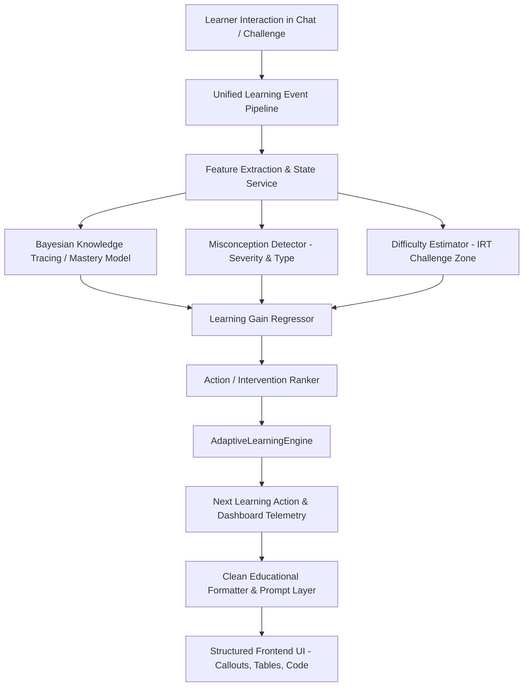

# LearnForge ML Architecture & Adaptive Engine

## 1. Executive Summary
LearnForge is an AI-powered adaptive learning platform designed to continuously observe learner responses, estimate real-time concept mastery, detect misconceptions, and calibrate optimal pedagogical interventions without relying on hardcoded static rules or uncalibrated LLM heuristics.

---

## 2. Core Machine Learning Modules

### A. Bayesian Knowledge Tracing (`server/ml/knowledge_state.py`)
- **Parameters**: Prior probability $P(L_0)=0.30$, Transition probability $P(T)=0.15$, Guess probability $P(G)=0.20$, Slip probability $P(S)=0.10$.
- **Observation Update**:
  $$P(L_t | \text{Correct}) = \frac{P(L_{t-1}) \cdot (1 - P(S))}{P(L_{t-1}) \cdot (1 - P(S)) + (1 - P(L_{t-1})) \cdot P(G)}$$
  $$P(L_t | \text{Incorrect}) = \frac{P(L_{t-1}) \cdot P(S)}{P(L_{t-1}) \cdot P(S) + (1 - P(L_{t-1})) \cdot (1 - P(G))}$$
- **Transition Step**:
  $$P(L_{t+1}) = P(L_t | \text{Obs}) + (1 - P(L_t | \text{Obs})) \cdot P(T)$$
- **Mastery Tiers**: Beginner ($<0.30$), Developing ($0.30-0.49$), Intermediate ($0.50-0.69$), Proficient ($0.70-0.84$), Mastered ($\ge 0.85$).

### B. Concept Mastery Predictor (`server/ml/mastery_predictor.py`)
- **Algorithm**: `GradientBoostingRegressor` trained on 6,000 synthetic interaction samples across 8 learner profiles.
- **Metrics**: MAE: 0.0026, RMSE: 0.0035, $R^2$: 0.9997.
- **Inputs**: Current mastery, difficulty, correctness, response time, explanation quality, confidence, misconception state, and recent gain.

### C. Misconception Detector (`server/ml/misconception_detector.py`)
- Distinguishes **Careless Slips** from **Knowledge Gaps** and **Persistent Misconceptions**.
- Flags severity as `NONE`, `LOW`, `MEDIUM`, or `HIGH` based on repeated evidence across sessions and high-confidence errors.

### D. Item Response Theory (IRT) Difficulty Estimator (`server/ml/difficulty_estimator.py`)
- Maps learner mastery to ability logit $\theta = \ln\left(\frac{M}{1 - M}\right)$.
- Solves for target item difficulty $b^* = \theta - \ln\left(\frac{P^*}{1 - P^*}\right)$ to target a productive 70–80% challenge zone.

### E. Learning Gain Predictor & Action Ranker (`server/ml/learning_gain_predictor.py`, `server/ml/action_ranker.py`)
- Predicts continuous expected gain $\Delta M$ for all 11 intervention types.
- Multi-factor utility formulation:
  $$\text{Utility} = 2.0 \cdot \Delta M + 0.3 \cdot P(\text{Success}) + 0.4 \cdot \text{MiscReduction} - 0.05 \cdot \text{Cost} - \text{FatiguePenalty}$$

### F. Trajectory Model & Final Mastery (`server/ml/trajectory_model.py`)
- Asymptotic growth projection: $M(t) = M_{\max} - (M_{\max} - M_0) \cdot e^{-k \cdot t}$.
- Forecasts projected mastery and remaining sessions required to achieve mastery.
